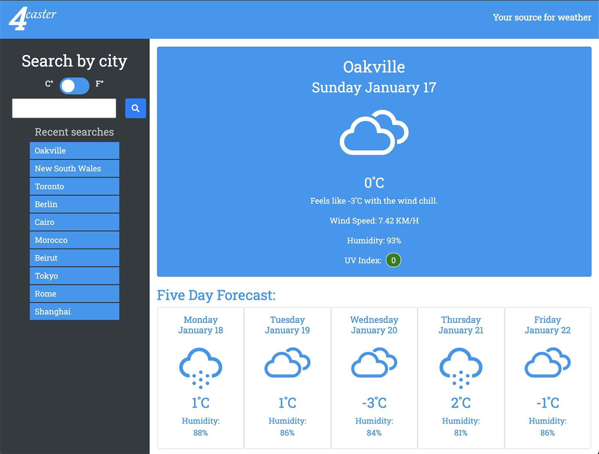

# 4caster - Weather Dashboard

## Description
1. Created a webpage that allows you to look up the weather by city. Used openweathermap.org's One Call API as well as the GeoCoding API. Also used bootstrap, moment.js, fontawesome and Erik Flower's weather-icons.
2. Used a bootstrap layout with a sidebar and bootstrap cards for look. 
3. Created script.js file for javascript with the following functions:
    1. searchWeather(): Takes the form information and passes it to the Geocoding API which returns the coordinates as well as the city name with properr capitalization. Save all of the info in variables. Use the coordinates to call the One Call API to get current weather data and 5 day forecast (actually gets 7 day, buut will only use 5). Call currentWeather() and weatherForecast() functions.
    2. currentWeather() creates the card to display the data for the current weather information
    3. weatherForecast() creates the cards to disply the five day forecast info.
    4. buildWeatherCard(), buildCommonCardElements() and buildHumidity() functions are used by currentWeather() and weatherForecast() to add elements common to both to the DOM.
    5. getUVLevel assigns the appropriate class to the UV info so that the correct coloour is shown.
    6. loadCities() gets the recent searches from local storage and add them to the sidebar
    7. saveCity() adds new city searches to local storage

## Screenshot

## Link to webpage
[4caster: Weather Dashboard](https://e-p-n.github.io/4caster)